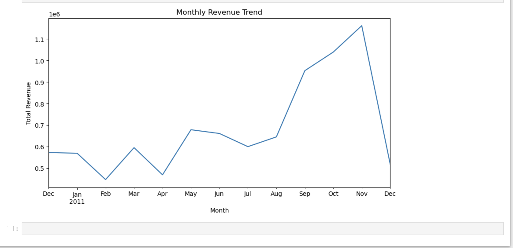

## 📂 Project Structure
├── data/
│   └── transactions.csv
├── sql/
│   └── analysis_queries.sql
├── notebooks/
│   └── sales_analysis.ipynb
├── Images/
│   └── Monthly_Revenue_Trend.png
└── README.md
## 📊 Key Insights
Based on the analysis, the following business insights were identified:

* **Data Integrity:** Approximately 25% of the raw data contained missing `CustomerID` or negative `Quantity` values. Cleaned this data to ensure revenue calculations reflect actual sales.
* **Revenue Concentration:** A small subset of top customers and products contributes to a significant portion of the total revenue.
* **Seasonal Trends:** Clear spikes in revenue are observed in the fourth quarter (Q4), as shown in the visualization below.

### 📈 Monthly Revenue Visualization


*Note: The chart above illustrates the growth and seasonality patterns discovered during the EDA phase.*

---

## 🛠️ How to Run
Follow these steps to set up and run the analysis on your local machine:

### 1. Clone the Repository:
```bash
git clone https://github.com/mahsafdei/business-transactions-analysis.git
cd business-transactions-analysis
```

2.  **Set Up a Virtual Environment (Optional but Recommended):**
```bash
python -m venv venv
source venv/bin/activate  # On Windows: venv\Scripts\activate
```

3.  **Install Dependencies:**
```bash
pip install pandas matplotlib seaborn notebook
```

4.  **Run the Analysis:**
* Open the `notebooks/sales_analysis.ipynb` file in Jupyter Notebook or VS Code to see the Python analysis and visualizations.
* Check the `sql/` folder for the standalone SQL queries used for data extraction.
---

### 👤 About Me
I am a Data Analyst with a Master’s degree in Mathematics and a professional background in Accounting. My expertise lies in bridging the gap between complex numerical data and actionable business insights.

🌍 Experience: Data analysis and financial reporting in both Iran and Canada.

💻 Tech Stack: Python (Pandas, Matplotlib), SQL, Excel, and Tableau.

📫 Connect with me:linkedin.com/in/mahsa-fadaei-980a55294
